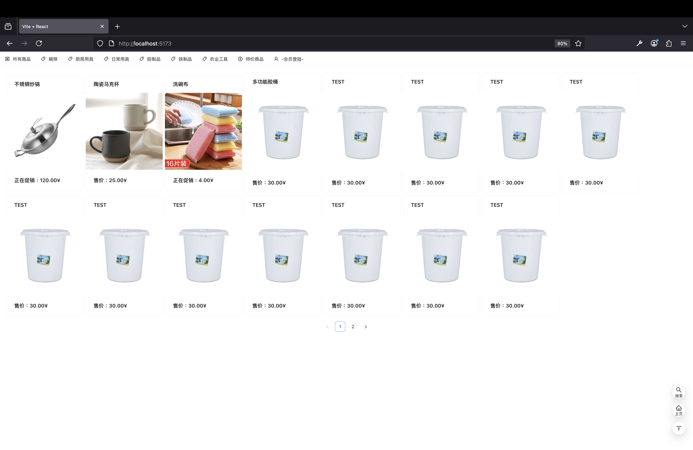
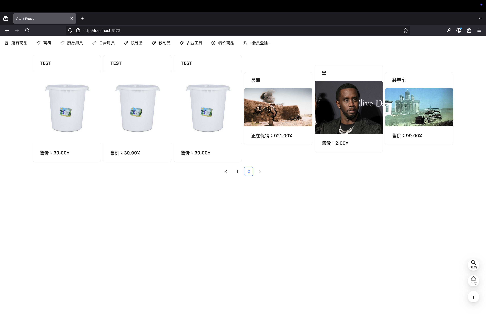
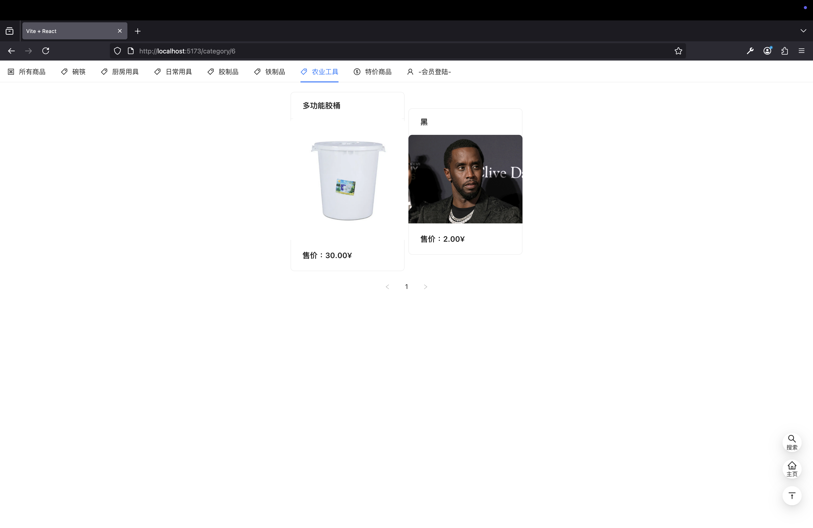
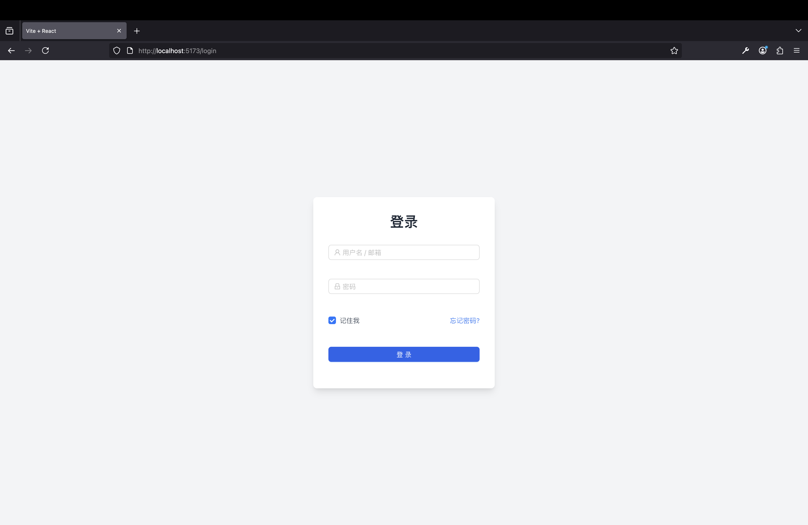
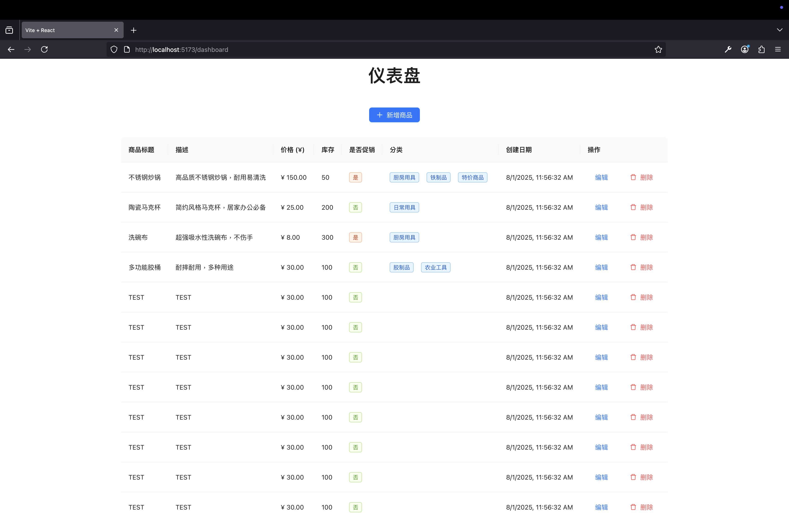
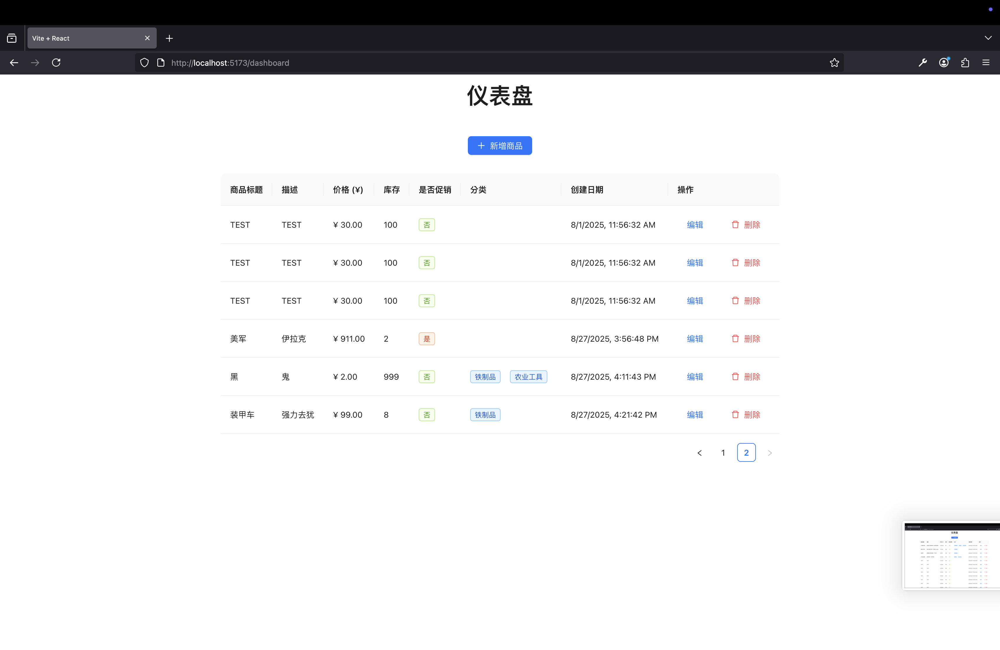
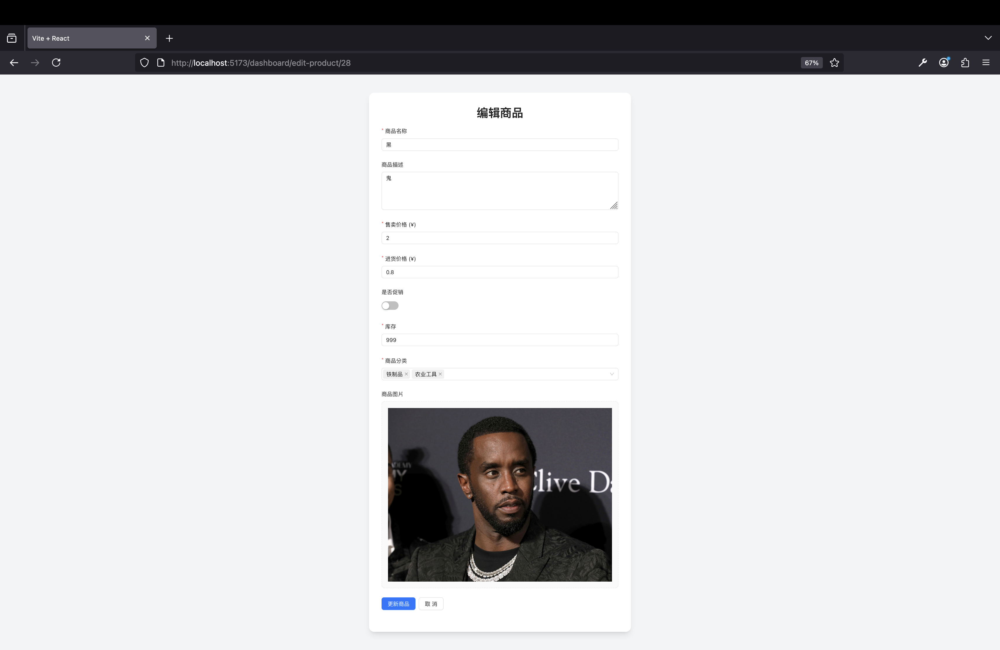
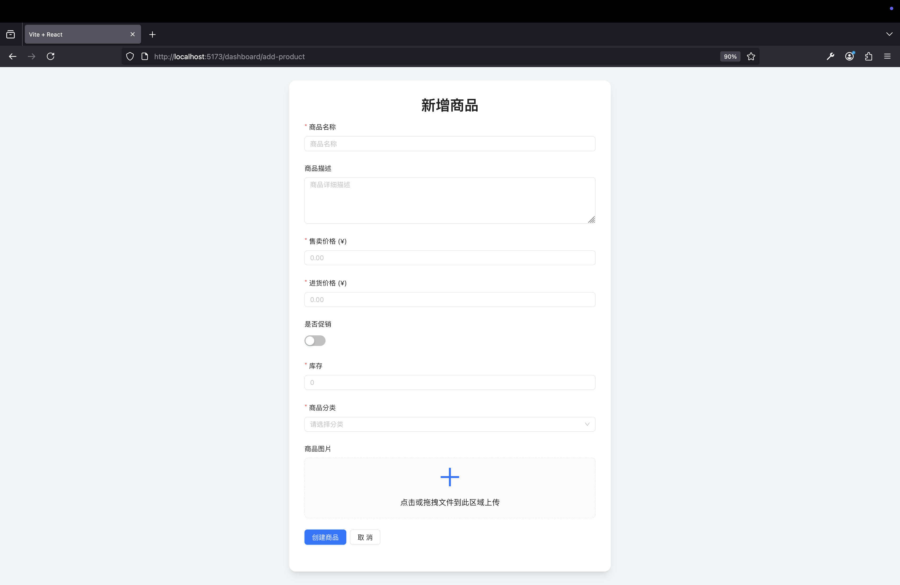

# Warehouse-Query-System - v1.0.1
这个仓储系统可以方便查询某样商品的情况，并且有详细开发笔记，方便从项目中学。

开发的每一步都有笔记和解释，如果你希望学习 Express+React+CSS组件库(AntDesign) 不妨看看这个项目，并试试二次开发。

你将在这个项目里学到 “文章”的增删改查，React的组件重新渲染和条件挂载，前端路由，分页功能，后端逻辑，目录结构(如果一点都不懂可以看我之前写的现代网页开发入门)，jwt登陆验证，CSS组件库(快速开发一个好看并实用的网页)

这是一个完全不营收的项目，如果你希望二次开发这个项目为自己所用，请记得标记原始出处 - Dontalk.org

目前该系统的版本是 v1.0.1 (带测试数据)，并且后台已经进行隐藏，如果不实现登陆 /login，那么访问后台(/dashboard)会返回404。

商品图片只允许存在一张(这是按照我的需求开发的)

Token 让浏览器操作，更加安全，逻辑可以稍微偷懒一些，但是JavaScript也无法操作和查询Token

## 目录结构
```
Screenshot                 // 此 MD 文档的截图
.
├── API                    // Express 后端路由
│   ├── auth               // jwt 加解密中间件
│   ├── config             // MySQL数据库配置文件
│   ├── middleware         // 中间件
│   ├── models             // 数据库模型
│   ├── routes             // 后端路由
│   └── uploads            // 图片上传的文件夹
│       └── images
│
│   Database.sql      // 数据库结构
│   encryptPasswd.js  // 生成符合要求的用户加密密码
│
└── hx-front               // React 前端
    ├── public             // vite LOGO(不会被编译)
    └── src                // 项目主要文件夹
        ├── assets         // 资源文件夹(会被编译成其他名字，logo之类的写死名字文件放在这里会导致找不到文件)
        ├── components     // 小组件文件夹(如导航栏和右下角按钮)
        ├── lib            // 这个是导入但是没用上的CSS组件库安装带来的
        └── pages          // 页面文件
            └── 旧页面  // 被抛弃的页面

hxbox.sql                  // 这个是数据库文件，管理员账号密码 admina和admin，带了测试数据
upload-test.html           // 测试后端图片上传功能
```

目录结构 如果一点都不懂可以看我之前写的现代网页开发入门

## 截图

主页


页尾


分类


后台登录


后台仪表盘


后台仪表盘页尾


编辑商品


新增商品

